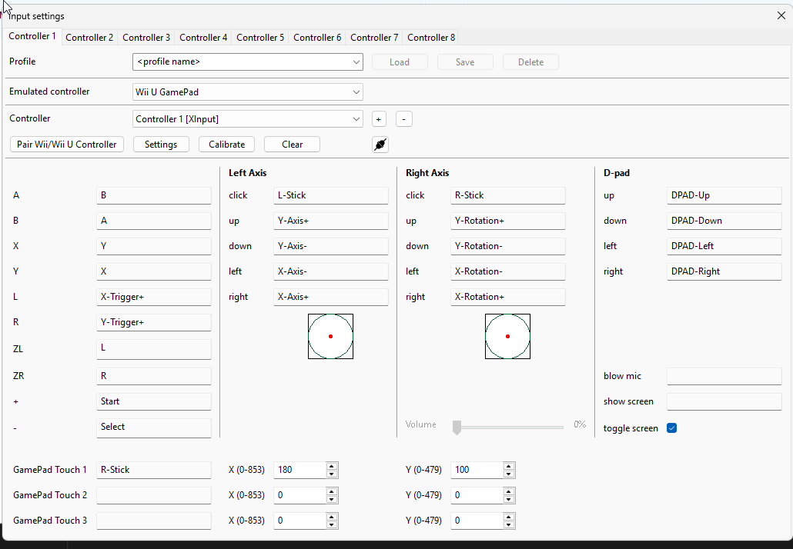

# Controller buttons to GamePad touch (Cemu v2.6)

Base: tag `v2.6`, commit `a6fb0a48eb437a8a41c13b782ac8ae0433bf8f98`.
This implementation uses that release's wxWidgets UI and input architecture.
It does not use Qt or source from the current main branch.

## Configure a binding

1. Open **Options → Input settings**.
2. Select **Wii U GamePad** as the emulated controller and select/add your physical controller using the usual API selector.
3. Click the input field beside **GamePad Touch 1**, **2**, or **3** and press the physical button (for example, R3).
4. Enter the logical touchscreen **X** and **Y** using the numeric editors.
5. Use the existing profile **Save** button to save a named profile. Closing Input Settings saves the current controller configuration, as before. Existing game-profile overrides retain their usual persistence restrictions.

Right-click a binding field, or press Escape while editing it, to clear the binding.
The existing **Clear** action clears all button mappings, including touch mappings.
Touch coordinates can remain configured without a mapped button; they cannot trigger input by themselves.
Binding a physical button to touch does not remove any ordinary controller action already mapped to that button. Clear that other mapping if you want touch alone.



The user confirmed that the feature works with a physical controller. The screenshot above records their working XInput R-Stick binding at X=180, Y=100; these coordinates are an example, not a default or a universal game-specific location.

For MH3U, map R3 to a GamePad Touch row and enter the location of its Target Camera monster-selection icon. **150,80 is only an example**, not a verified MH3U coordinate. There is no game-specific behavior.
Determine the icon's position on the GamePad image at native 854×480 resolution. If inspecting a scaled image, subtract any border/letterbox offset and scale the position by `854 / imageWidth` horizontally and `480 / imageHeight` vertically. TV coordinates and window borders are irrelevant. No interactive coordinate picker is included.

## Coordinate system and sampling

Stored coordinates use native GamePad pixels: **X 0–853, Y 0–479**, origin at the top-left, positive Y downward.
Values loaded from XML are clamped to these bounds. Slots outside the supported range are ignored.

Cemu v2.6 exposes raw 12-bit touchscreen values in `VPADTPData_t`; its inverse calibration is:

```
rawX = uint16(normalizedX * 3883 + 92)
rawY = uint16(4095 - normalizedY * 3694 - 254)
```

The existing pointer path still supplies normalized image coordinates to precisely this conversion.
Synthetic input aims at the configured pixel center:

```
normalizedX = (X + 0.5) / 854
normalizedY = (Y + 0.5) / 480
```

Using pixel centers avoids losing one pixel when both inverse conversion and game-side calibration truncate to integers. `VPADGetTPCalibratedPointEx` continues converting these raw values to the game's requested resolution, including 854×480 or 1280×720. The default `VPADGetTPCalibratedPoint` uses 1280×720. Stored values always remain in native 854×480 space.

The synthetic path never queries window geometry. Hiding, resizing or moving a GamePad window cannot change the configured point.

## Architecture inspected in v2.6

| Area | Existing implementation |
| --- | --- |
| Physical controllers | `src/input/api/Controller.h`, `Controller.cpp`, API backends (SDL, XInput, DirectInput, keyboard, DSU, etc.) |
| Physical buttons | `ControllerState::buttons`, `ControllerButtonState::GetButtonState`; backend-specific numeric button IDs |
| Mapping | `EmulatedController::m_mappings`: action ID → weak controller reference + physical button ID; `set_mapping`, `is_mapping_down` |
| Sampling | `VPADController::VPADRead` calls `controllers_update_states`, builds normal hold/trig/release masks and calls `update_touch` |
| Existing special actions | Mic and show-screen mapping IDs with no normal VPAD button flag |
| Host mouse/touch | `MainWindow.cpp`, `PadViewFrame.cpp` update `InputManager` mouse/touch state, including position, held state and a short-click latch |
| Pointer selection | `InputManager::get_left_down_mouse_info` prioritizes main mouse, main native touch, pad mouse, pad native touch |
| Mouse conversion | `VPADController::update_touch` obtains the rendered image area using `LatteRenderTarget_getScreenImageArea`, clamps and normalizes pointer coordinates |
| Controller position input | `EmulatedController::has_position/get_position`, checked before mouse input |
| Guest touch data | `VPADStatus_t::tpData`, `tpProcessed1`, `tpProcessed2` contain raw X/Y, on/off state and validity |
| Guest entry point | `src/Cafe/OS/libs/vpad/vpad.cpp::VPADRead` supplies the status to guest software; calibration functions convert raw coordinates |
| Persistence | `InputManager::save/load` uses `controllerProfiles/*.xml`; calls virtual emulated-controller `save/load` for custom settings; legacy `.txt` migration remains unchanged |
| Configuration UI | wxWidgets `InputSettings2`, `InputPanel`, `VPADInputPanel`; the mapping widgets reuse `InputPanel::on_timer` to capture physical input |

There is no internal touchscreen down/up event queue in this version. On/off states are sampled in `VPADStatus_t`, so this feature uses that same mechanism:

```
physical controller button state
  → existing EmulatedController mapping (IDs 28–30)
  → GamePad Touch action + configured logical X/Y
  → GamePadTouch::Read / shared inverse calibration
  → VPADController::update_touch
  → tpData and both processed touch samples
  → guest VPADRead / normal calibration API
  → Wii U game
```

A pressed button supplies touch DOWN on each sample as one continuous contact. Release supplies UP with invalid touch state and the previous X/Y preserved, matching existing mouse behavior. No repeat timer or repeated-tap behavior is used. Touch mappings do not set VPAD controller button flags or participate in button repeat.

The touchscreen has one contact:

- Existing controller position input and host pointer input keep their priority.
- Without pointer input, the first held touch row (1, then 2, then 3) wins.
- Releasing the winning row while another remains held moves the contact to that row; it does not insert an extra UP/DOWN tap.
- When pointer input ends, a still-held synthetic binding resumes at its configured coordinate.
- Disconnecting/removing a controller or deleting a binding makes its mapping inactive, using the existing physical-state/mapping behavior.
- Press/release pairs entirely between guest input samples may be missed, like ordinary sampled controller buttons in v2.6. No synthetic event queue or controller short-press latch is introduced. Rapid presses that reach successive samples produce matching DOWN/UP states.

## Persistence

Normal button mappings are saved by the unchanged `InputManager` serializer, under each physical controller:

```xml
<mappings>
  <entry><mapping>28</mapping><button>PHYSICAL_BUTTON_ID</button></entry>
</mappings>
```

Touch positions use the existing per-emulated-controller custom settings hook:

```xml
<gamepad_touch>
  <entry slot="0"><x>150</x><y>80</y></entry>
  <entry slot="1"><x>0</x><y>0</y></entry>
  <entry slot="2"><x>0</x><y>0</y></entry>
</gamepad_touch>
```

The three slots correspond to mapping IDs 28, 29 and 30. All existing IDs 1–27 are unchanged. Profiles without `gamepad_touch` get zero coordinate defaults and have no touch action unless one is explicitly mapped. There is no schema-version change: v2.6 uses optional XML fields for custom controller settings. Named and default profiles use the same serializer. No separate settings file or dependency is added.

X/Y are published as one atomic packed value, preventing mixed coordinates when the UI edits settings during input sampling. The sampling state itself belongs to the GamePad controller, rather than shared mouse state.

## Build and verification

The release's `BUILD.md`, root CMake files, `vcpkg.json` and `.github/workflows/build.yml` were inspected. Windows uses Visual Studio 2022, an SDK, C++20, CMake ≥3.21.1 and the pinned recursive submodules/vcpkg baseline. Main targets are `CemuBin`, `CemuInput`, and `CemuGui`. The original tree has assorted internal self-tests but no dedicated input CTest suite.

Enable the added tests with:

```powershell
cmake -S . -B build -G "Visual Studio 17 2022" -A x64 -DCEMU_BUILD_TOUCH_TESTS=ON
cmake --build build --config Release --target CemuBin GamePadTouchTests GamePadTouchIntegrationTests --parallel 4
ctest --test-dir build -C Release --output-on-failure
```

On Windows, also pass `-DCMAKE_BUILD_TYPE=Release` so the release libusb pkg-config metadata is selected. Use the same installed MSVC toolset for Cemu and vcpkg dependencies. The tested build explicitly selects MSVC 14.44.35207 using `-T "version=14.44.35207"`. Version labels can be set with `-DEMULATOR_VERSION_MAJOR=2 -DEMULATOR_VERSION_MINOR=6`.

The unit suite tests continuous DOWN and release, sampled rapid presses, pointer priority, multiple bindings, unchanged pointer conversion, every native pixel's calibration round trip, XML serialization/deserialization, old profiles, malformed slot/bounds handling and independence from prior pointer geometry.

The integration suite uses the real `ControllerBase` sampling and `EmulatedController` mapping paths to assert `VPADStatus_t` touch output, ordinary button hold/trig/release, binding removal, the actual `InputManager` profile file serializer/loader and old profile loading. It feeds the existing internal mouse/native-touch state through the actual mouse-to-VPAD conversion, checks the short mouse-click latch and synthetic resumption, and changes the display geometry/visibility metadata to verify invariant synthetic coordinates. It also creates a hidden wxWidgets mapping panel to verify button capture, numeric edits and profile-coordinate restoration.

Validation on this workspace:

- `CemuBin`, `CemuInput`, `CemuGui`, `GamePadTouchTests` and `GamePadTouchIntegrationTests` built successfully in Release using MSVC 14.44.35207. Executable: `bin/Cemu_release.exe`, labeled version 2.6.
- `ctest --test-dir build/msvc144 -C Release --output-on-failure --timeout 60`: **2/2 passed**, 2.92 seconds. The unit suite checked all 409,920 native pixels against the v2.6 calibration formula.
- The real input mapping, VPAD touch output, unchanged normal controller/mouse/native-touch paths, file persistence, old profiles, display metadata changes and hidden wxWidgets editor tests all passed.
- `git diff --check` and patch reverse-application checks were used for final review.
- The user confirmed a successful interactive physical-controller test and supplied the configuration screenshot above. The automated tests exercise Cemu's native input paths without a game or visible GamePad window. No separate manual results are claimed for resizing, pointer arbitration or every supported controller backend.
- Existing upstream warnings remain in unrelated USB UI code, RapidJSON, libusb and cubeb runtime linkage. No warnings were emitted from the new touch implementation or mapping editor. Unrelated source was not changed to suppress those warnings.

Build preparation required two local toolchain repairs, with no changes to dependency versions or source:

1. The pinned vcpkg bootstrap requested an expired MSYS2 pkgconf archive (404). A standalone pkgconf 3.0.7 was extracted under `build/tools/pkgconf` and supplied through `PKG_CONFIG` / `VCPKG_KEEP_ENV_VARS` for dependency preparation. The build subsequently uses the pinned vcpkg pkgconf 2.2.0.
2. Multiple installed MSVC versions caused CMake and libusb's MSBuild project to select MSVC 14.38 while other dependencies used 14.44. The final build uses `build/msvc144`, `-T "version=14.44.35207"`, `-DCMAKE_BUILD_TYPE=Release`, `-DCEMU_CXX_FLAGS=/MP4`, and the existing `build/vcpkg_installed` directory. Pinned libusb 1.0.27 was rebuilt with `/p:VCToolsVersion=14.44.35207` into `build/msvc144/libusb144`; CMake's `pkgcfg_lib_libusb_libusb-1.0` points to that matching release library. Its warnings policy matches the existing vcpkg build (`/WX-`).

To rebuild this configured workspace, use:

```powershell
cmake --build build/msvc144 --config Release --target CemuBin GamePadTouchTests GamePadTouchIntegrationTests --parallel 2
ctest --test-dir build/msvc144 -C Release --output-on-failure --timeout 60
```

Build/configuration logs and the test report are retained under `build/`. The physical-controller success report is user-provided; the automated checks and build were run in this workspace.

The implementation has no mouse movement, OS click injection, external controller remapper, AutoHotkey, GamePad-window visibility requirement, game detection or fixed gameplay coordinate. The examples and test coordinates do not determine runtime mappings.
